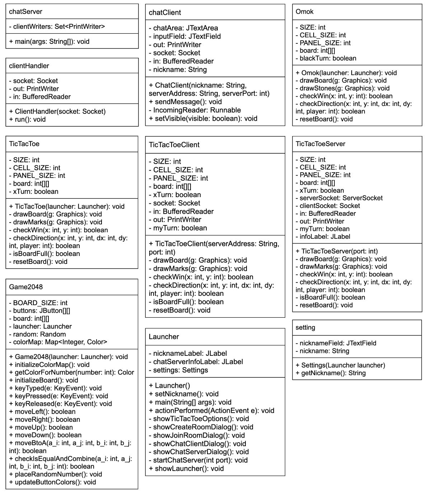

# GameLauncher

최준혁 21900764

김종혜 22200171

## Description

The goal of our program is to develop a game launcher that includes two classic board games: Tic Tac Toe and 오목 (Concave game or Five in a Row), and 2048. The objective of the program is to develop a program using Swing for GUI and socket programming for the functionality of multiplayer. Our program is going to have the features to choose between playing Tic Tac Toc, 오목, or 2048 from the launcher’s main menu. The 오목 game involves players placing stones on a 15x15 board to defeat the opponent strategically. The game will update the board each time a player places a stone and verify the win condition after each move to determine the winner. The Tic Tac Toe game is played in a 3x3 board where players take turns placing an ‘X’ or ‘O’ to create a row, column, or diagonal of three identical symbols to win the game. The application should update the board after each player’s moves and check for win conditions. Additionally, 2048 is a single-player block sliding puzzle game where the player combines numbered tiles on a grid to create a tile with the number 2048. The game is continued until there are no more moves available and the highest score is achieved. The program should support a multiplayer mode allowing players to enjoy the game simultaneously.  

## UML Diagram

## User's guide

[User's Guide](doc/user_guide.pdf)

## Environments

Java 16

Gradle 7.5.1

## How to run?
cd GameLauncherCode

gradle build

gradle run

## ChatServer
javac ChatServer.java

java ChatServer

### How to know server address
use 'ifconfig' command
